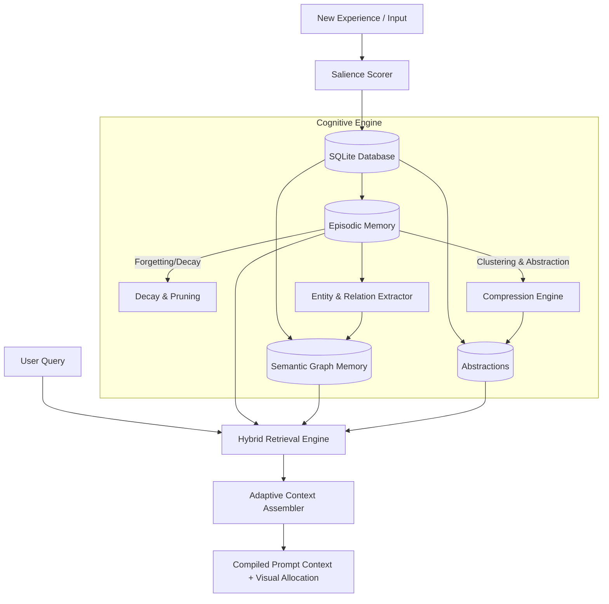

# Intelligent Memory System (IMS)

An advanced, full-stack cognitive memory framework simulating the human brain's memory pipelines. Built to explore how AI agents can manage long-term contexts, abstract knowledge, build associations, and forget low-salience data.

## System Flowchart



## Key Cognitive Features

*   🧠 **Episodic Memory**: Chronological storage of experiences with timestamps and rich metadata.
*   📐 **Salience Scoring**: Multi-dimensional scoring evaluating **Importance** (action/goal weight), **Emotional Charge** (valence/arousal markers), and **Novelty** (distance from prior memories).
*   📉 **Forgetting (Decay & Pruning)**: Implements exponential decay of salience over time ($S(t) = S_0 \cdot e^{-\lambda t}$). Low-salience memories are forgotten (archived/pruned) unless tied to active nodes.
*   🌿 **Semantic Graph Memory**: Real-time extraction of entities (nodes) and relations (edges) from episodes, forming an active knowledge graph.
*   📦 **Compression & Abstraction**: Clusters older, related memories and collapses them into a high-level summary (`AbstractionNode`), reducing token footprints.
*   🔍 **Hybrid Retrieval**: Multimodal search evaluating query similarity, recency, and current salience.
*   🎭 **Adaptive Context Assembly**: Dynamically builds prompt context for a specific token/word budget, prioritizing abstractions, recent episodes, and semantic links.

---

## Getting Started

### 1. Backend Setup (FastAPI)
Navigate to the `backend` directory, create a virtual environment, install requirements, and run the server.

```bash
cd backend
python -m venv venv
.\venv\Scripts\activate
pip install -r requirements.txt
python -m uvicorn app.main:app --reload
```
The backend runs at `http://127.0.0.1:8000`.

### 2. Frontend Setup (React + Vite)
Navigate to the `frontend` directory, install packages, and start the development server.

```bash
cd frontend
npm install
npm run dev
```
The frontend dashboard will run at `http://localhost:5173`.

---

## Project Structure

```
├── backend/
│   ├── app/
│   │   ├── memory/          # Cognitive memory sub-modules
│   │   │   ├── salience.py
│   │   │   ├── forgetting.py
│   │   │   ├── graph.py
│   │   │   ├── compression.py
│   │   │   ├── retrieval.py
│   │   │   └── context_assembly.py
│   │   ├── database.py      # SQLite connection config
│   │   ├── models.py        # SQLAlchemy schema definitions
│   │   └── main.py          # FastAPI application server
│   └── requirements.txt     # Python dependencies
└── frontend/
    ├── src/
    │   ├── App.jsx          # React dashboard
    │   ├── index.css        # Cyberpunk glassmorphism styling
    │   └── main.jsx
    └── package.json
```
