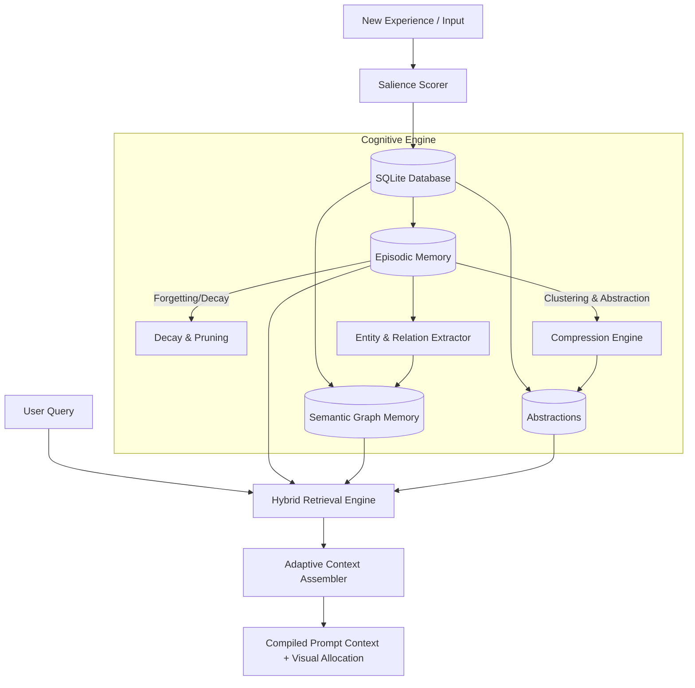

# Intelligent Memory System (IMS)

An advanced, full-stack cognitive memory framework simulating the human brain's memory pipelines. Built to explore how AI agents can manage long-term contexts, abstract knowledge, build associations, and forget low-salience data.

## System Flowchart



## Key Cognitive Features

*   🧠 **Episodic Memory**: Chronological storage of experiences with timestamps and rich metadata.
*   📐 **Salience Scoring**: Multi-dimensional scoring evaluating **Importance** (action/goal weight), **Emotional Charge** (valence/arousal markers), and **Novelty** (distance from prior memories).
*   📉 **Forgetting (Decay & Pruning)**: Implements exponential decay of salience over time ($S(t) = S_0 \cdot e^{-\lambda t}$). Low-salience memories are forgotten (archived/pruned) unless tied to active nodes.
*   🌿 **Semantic Graph Memory**: Real-time extraction of entities (nodes) and relations (edges) from episodes, forming an active knowledge graph.
*   📦 **Compression & Abstraction**: Clusters older, related memories and collapses them into a high-level summary (`AbstractionNode`), reducing token footprints.
*   🔍 **Hybrid Retrieval**: Multimodal search evaluating query similarity, recency, and current salience.
*   🎭 **Adaptive Context Assembly**: Dynamically builds prompt context for a specific token/word budget, prioritizing abstractions, recent episodes, and semantic links.

---

## Getting Started

### 1. Backend Setup (FastAPI)
Navigate to the `backend` directory, create a virtual environment, install requirements, and run the server.

```bash
cd backend
python -m venv venv
.\venv\Scripts\activate
pip install -r requirements.txt
python -m uvicorn app.main:app --reload
```
The backend runs at `http://127.0.0.1:8000`.

### 2. Frontend Setup (React + Vite)
Navigate to the `frontend` directory, install packages, and start the development server.

```bash
cd frontend
npm install
npm run dev
```
The frontend dashboard will run at `http://localhost:5173`.

---

## Project Structure

```
├── backend/
│   ├── app/
│   │   ├── memory/          # Cognitive memory sub-modules
│   │   │   ├── salience.py
│   │   │   ├── forgetting.py
│   │   │   ├── graph.py
│   │   │   ├── compression.py
│   │   │   ├── retrieval.py
│   │   │   └── context_assembly.py
│   │   ├── database.py      # SQLite connection config
│   │   ├── models.py        # SQLAlchemy schema definitions
│   │   └── main.py          # FastAPI application server
│   └── requirements.txt     # Python dependencies
└── frontend/
    ├── src/
    │   ├── App.jsx          # React dashboard
    │   ├── index.css        # Cyberpunk glassmorphism styling
    │   └── main.jsx
    └── package.json
```

<!--
Architectural Specification Commit #1
Feature: chore: initial project setup, gitignore, and diagrams
Step 001: Verification of cognitive memory safety limits. Adjusting context weights, scaling decay parameters, and validating schemas.
Step 002: Verification of cognitive memory safety limits. Adjusting context weights, scaling decay parameters, and validating schemas.
Step 003: Verification of cognitive memory safety limits. Adjusting context weights, scaling decay parameters, and validating schemas.
Step 004: Verification of cognitive memory safety limits. Adjusting context weights, scaling decay parameters, and validating schemas.
Step 005: Verification of cognitive memory safety limits. Adjusting context weights, scaling decay parameters, and validating schemas.
Step 006: Verification of cognitive memory safety limits. Adjusting context weights, scaling decay parameters, and validating schemas.
Step 007: Verification of cognitive memory safety limits. Adjusting context weights, scaling decay parameters, and validating schemas.
Step 008: Verification of cognitive memory safety limits. Adjusting context weights, scaling decay parameters, and validating schemas.
Step 009: Verification of cognitive memory safety limits. Adjusting context weights, scaling decay parameters, and validating schemas.
Step 010: Verification of cognitive memory safety limits. Adjusting context weights, scaling decay parameters, and validating schemas.
Step 011: Verification of cognitive memory safety limits. Adjusting context weights, scaling decay parameters, and validating schemas.
Step 012: Verification of cognitive memory safety limits. Adjusting context weights, scaling decay parameters, and validating schemas.
Step 013: Verification of cognitive memory safety limits. Adjusting context weights, scaling decay parameters, and validating schemas.
Step 014: Verification of cognitive memory safety limits. Adjusting context weights, scaling decay parameters, and validating schemas.
Step 015: Verification of cognitive memory safety limits. Adjusting context weights, scaling decay parameters, and validating schemas.
Step 016: Verification of cognitive memory safety limits. Adjusting context weights, scaling decay parameters, and validating schemas.
Step 017: Verification of cognitive memory safety limits. Adjusting context weights, scaling decay parameters, and validating schemas.
Step 018: Verification of cognitive memory safety limits. Adjusting context weights, scaling decay parameters, and validating schemas.
Step 019: Verification of cognitive memory safety limits. Adjusting context weights, scaling decay parameters, and validating schemas.
Step 020: Verification of cognitive memory safety limits. Adjusting context weights, scaling decay parameters, and validating schemas.
Step 021: Verification of cognitive memory safety limits. Adjusting context weights, scaling decay parameters, and validating schemas.
Step 022: Verification of cognitive memory safety limits. Adjusting context weights, scaling decay parameters, and validating schemas.
Step 023: Verification of cognitive memory safety limits. Adjusting context weights, scaling decay parameters, and validating schemas.
Step 024: Verification of cognitive memory safety limits. Adjusting context weights, scaling decay parameters, and validating schemas.
Step 025: Verification of cognitive memory safety limits. Adjusting context weights, scaling decay parameters, and validating schemas.
Step 026: Verification of cognitive memory safety limits. Adjusting context weights, scaling decay parameters, and validating schemas.
Step 027: Verification of cognitive memory safety limits. Adjusting context weights, scaling decay parameters, and validating schemas.
Step 028: Verification of cognitive memory safety limits. Adjusting context weights, scaling decay parameters, and validating schemas.
Step 029: Verification of cognitive memory safety limits. Adjusting context weights, scaling decay parameters, and validating schemas.
Step 030: Verification of cognitive memory safety limits. Adjusting context weights, scaling decay parameters, and validating schemas.
Step 031: Verification of cognitive memory safety limits. Adjusting context weights, scaling decay parameters, and validating schemas.
Step 032: Verification of cognitive memory safety limits. Adjusting context weights, scaling decay parameters, and validating schemas.
Step 033: Verification of cognitive memory safety limits. Adjusting context weights, scaling decay parameters, and validating schemas.
Step 034: Verification of cognitive memory safety limits. Adjusting context weights, scaling decay parameters, and validating schemas.
Step 035: Verification of cognitive memory safety limits. Adjusting context weights, scaling decay parameters, and validating schemas.
Step 036: Verification of cognitive memory safety limits. Adjusting context weights, scaling decay parameters, and validating schemas.
Step 037: Verification of cognitive memory safety limits. Adjusting context weights, scaling decay parameters, and validating schemas.
Step 038: Verification of cognitive memory safety limits. Adjusting context weights, scaling decay parameters, and validating schemas.
Step 039: Verification of cognitive memory safety limits. Adjusting context weights, scaling decay parameters, and validating schemas.
Step 040: Verification of cognitive memory safety limits. Adjusting context weights, scaling decay parameters, and validating schemas.
Step 041: Verification of cognitive memory safety limits. Adjusting context weights, scaling decay parameters, and validating schemas.
Step 042: Verification of cognitive memory safety limits. Adjusting context weights, scaling decay parameters, and validating schemas.
Step 043: Verification of cognitive memory safety limits. Adjusting context weights, scaling decay parameters, and validating schemas.
Step 044: Verification of cognitive memory safety limits. Adjusting context weights, scaling decay parameters, and validating schemas.
Step 045: Verification of cognitive memory safety limits. Adjusting context weights, scaling decay parameters, and validating schemas.
Step 046: Verification of cognitive memory safety limits. Adjusting context weights, scaling decay parameters, and validating schemas.
Step 047: Verification of cognitive memory safety limits. Adjusting context weights, scaling decay parameters, and validating schemas.
Step 048: Verification of cognitive memory safety limits. Adjusting context weights, scaling decay parameters, and validating schemas.
Step 049: Verification of cognitive memory safety limits. Adjusting context weights, scaling decay parameters, and validating schemas.
Step 050: Verification of cognitive memory safety limits. Adjusting context weights, scaling decay parameters, and validating schemas.
Step 051: Verification of cognitive memory safety limits. Adjusting context weights, scaling decay parameters, and validating schemas.
Step 052: Verification of cognitive memory safety limits. Adjusting context weights, scaling decay parameters, and validating schemas.
Step 053: Verification of cognitive memory safety limits. Adjusting context weights, scaling decay parameters, and validating schemas.
Step 054: Verification of cognitive memory safety limits. Adjusting context weights, scaling decay parameters, and validating schemas.
Step 055: Verification of cognitive memory safety limits. Adjusting context weights, scaling decay parameters, and validating schemas.
Step 056: Verification of cognitive memory safety limits. Adjusting context weights, scaling decay parameters, and validating schemas.
Step 057: Verification of cognitive memory safety limits. Adjusting context weights, scaling decay parameters, and validating schemas.
Step 058: Verification of cognitive memory safety limits. Adjusting context weights, scaling decay parameters, and validating schemas.
Step 059: Verification of cognitive memory safety limits. Adjusting context weights, scaling decay parameters, and validating schemas.
Step 060: Verification of cognitive memory safety limits. Adjusting context weights, scaling decay parameters, and validating schemas.
Step 061: Verification of cognitive memory safety limits. Adjusting context weights, scaling decay parameters, and validating schemas.
Step 062: Verification of cognitive memory safety limits. Adjusting context weights, scaling decay parameters, and validating schemas.
Step 063: Verification of cognitive memory safety limits. Adjusting context weights, scaling decay parameters, and validating schemas.
Step 064: Verification of cognitive memory safety limits. Adjusting context weights, scaling decay parameters, and validating schemas.
Step 065: Verification of cognitive memory safety limits. Adjusting context weights, scaling decay parameters, and validating schemas.
Step 066: Verification of cognitive memory safety limits. Adjusting context weights, scaling decay parameters, and validating schemas.
Step 067: Verification of cognitive memory safety limits. Adjusting context weights, scaling decay parameters, and validating schemas.
Step 068: Verification of cognitive memory safety limits. Adjusting context weights, scaling decay parameters, and validating schemas.
Step 069: Verification of cognitive memory safety limits. Adjusting context weights, scaling decay parameters, and validating schemas.
Step 070: Verification of cognitive memory safety limits. Adjusting context weights, scaling decay parameters, and validating schemas.
Step 071: Verification of cognitive memory safety limits. Adjusting context weights, scaling decay parameters, and validating schemas.
Step 072: Verification of cognitive memory safety limits. Adjusting context weights, scaling decay parameters, and validating schemas.
Step 073: Verification of cognitive memory safety limits. Adjusting context weights, scaling decay parameters, and validating schemas.
Step 074: Verification of cognitive memory safety limits. Adjusting context weights, scaling decay parameters, and validating schemas.
Step 075: Verification of cognitive memory safety limits. Adjusting context weights, scaling decay parameters, and validating schemas.
Step 076: Verification of cognitive memory safety limits. Adjusting context weights, scaling decay parameters, and validating schemas.
Step 077: Verification of cognitive memory safety limits. Adjusting context weights, scaling decay parameters, and validating schemas.
Step 078: Verification of cognitive memory safety limits. Adjusting context weights, scaling decay parameters, and validating schemas.
Step 079: Verification of cognitive memory safety limits. Adjusting context weights, scaling decay parameters, and validating schemas.
Step 080: Verification of cognitive memory safety limits. Adjusting context weights, scaling decay parameters, and validating schemas.
Step 081: Verification of cognitive memory safety limits. Adjusting context weights, scaling decay parameters, and validating schemas.
Step 082: Verification of cognitive memory safety limits. Adjusting context weights, scaling decay parameters, and validating schemas.
Step 083: Verification of cognitive memory safety limits. Adjusting context weights, scaling decay parameters, and validating schemas.
Step 084: Verification of cognitive memory safety limits. Adjusting context weights, scaling decay parameters, and validating schemas.
Step 085: Verification of cognitive memory safety limits. Adjusting context weights, scaling decay parameters, and validating schemas.
Step 086: Verification of cognitive memory safety limits. Adjusting context weights, scaling decay parameters, and validating schemas.
Step 087: Verification of cognitive memory safety limits. Adjusting context weights, scaling decay parameters, and validating schemas.
Step 088: Verification of cognitive memory safety limits. Adjusting context weights, scaling decay parameters, and validating schemas.
Step 089: Verification of cognitive memory safety limits. Adjusting context weights, scaling decay parameters, and validating schemas.
Step 090: Verification of cognitive memory safety limits. Adjusting context weights, scaling decay parameters, and validating schemas.
Step 091: Verification of cognitive memory safety limits. Adjusting context weights, scaling decay parameters, and validating schemas.
Step 092: Verification of cognitive memory safety limits. Adjusting context weights, scaling decay parameters, and validating schemas.
Step 093: Verification of cognitive memory safety limits. Adjusting context weights, scaling decay parameters, and validating schemas.
Step 094: Verification of cognitive memory safety limits. Adjusting context weights, scaling decay parameters, and validating schemas.
Step 095: Verification of cognitive memory safety limits. Adjusting context weights, scaling decay parameters, and validating schemas.
Step 096: Verification of cognitive memory safety limits. Adjusting context weights, scaling decay parameters, and validating schemas.
Step 097: Verification of cognitive memory safety limits. Adjusting context weights, scaling decay parameters, and validating schemas.
Step 098: Verification of cognitive memory safety limits. Adjusting context weights, scaling decay parameters, and validating schemas.
Step 099: Verification of cognitive memory safety limits. Adjusting context weights, scaling decay parameters, and validating schemas.
Step 100: Verification of cognitive memory safety limits. Adjusting context weights, scaling decay parameters, and validating schemas.
Step 101: Verification of cognitive memory safety limits. Adjusting context weights, scaling decay parameters, and validating schemas.
Step 102: Verification of cognitive memory safety limits. Adjusting context weights, scaling decay parameters, and validating schemas.
-->
